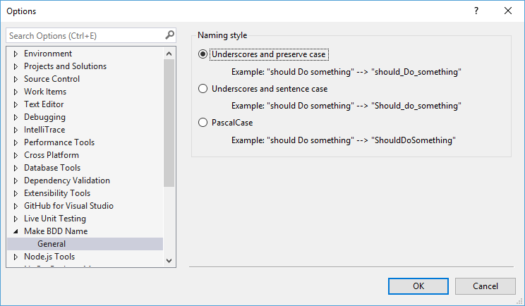

# Road Map

- [x] Converting a string into a BDD name
- [x] Options screen that allows configuring the BDD name style (underscores,
      title case, lower case, etc.)
- [ ] Ability to define a standard for unit test names for each solution.
- [ ] Roslyn C# analyzer to detect unit test classes and methods and be able to convert to/from the
      defined standard for the project

Features that have a checkmark are complete and available for download in the
[CI build](http://vsixgallery.com/extension/3ad8ab11-a54c-4f40-8926-d25d05ac7ec6/).

# Change Log

These are the changes to each version that have been released on the official
Visual Studio extension gallery.

## 1.0

* Initial release
* Convert a string into a BDD name with underscores

## 1.1

* Visual Studio 2017 compatibility
* Fixed the preview image and icon for the package so they show up in the gallery correctly

## 1.2

**New Feature:** Added the ability to create BDD names in different formats and to convert to and from
  the different formats.
* Sentence with underscores: `"should do something"` -> `should_do_something`
* Sentence with uppercase start: `"should do something"` -> `Should_do_something`
* PascalCase: `"should do something"` -> `ShouldDoSomething`

There is a new options page that lets you specify the default format.

## 1.3

* Fix issue #1: selections of the form "foo bar baz" were not getting properly tranlsated. The
  problem was that I was not properly caching the selection before changing it to check for quote
  characters.
* Fix issue #2: Turn off logging when not in debug mode. It was just a simple type-o where I used
  `Logger.Log` instead of `Logger.LogDebug`.
