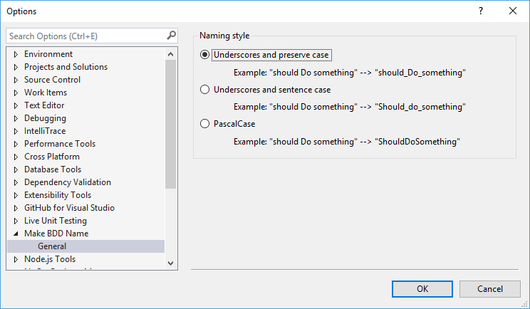

# Make BDD Name

Download the extension at the
[VS Gallery](https://visualstudiogallery.msdn.microsoft.com/00d78ffb-9c19-49b4-a522-f551553414bb)
or get the
[nightly build](http://vsixgallery.com/extension/3ad8ab11-a54c-4f40-8926-d25d05ac7ec6/)

--------------------------------------------------------------------------------

Do you like to use a Jasmine/BDD style of naming your C#/VB test methods? Are
you tired of typing an underscore between words? Then this extension is for you!
Simply type your sentence in quotes using spaces, punctuation, or whatever else
you want, then hit `Ctrl+', Ctrl+'` to convert the sentence to a C#-compatible
method or class name.

See the [changelog](CHANGELOG.md) for updates and roadmap.

## Features

Easily type a BDD-style sentence in quotes for a class or method name, and then
hit `Ctrl+', Ctrl+'` or select "Make BDD Name" from the shortcut menu.

Watch a video of the usage [here](art/demo.mp4).

Specify what format you want your BDD sentences in from Tools/Options.
* Underscores and preserve case ("should Do something" --> `should_Do_something`)
* Underscores and sentence case ("should Do something" --> `Should_do_something`)
* PascalCase ("should Do something" --> `ShouldDoSomething`)

You can convert to and from existing names. For example, if you have an existing
method named `ShouldDoSomething` and your options specify "Underscores and
sentence case", then invoking the command with your selection somewhere within
the method name will convert the method to `Should_do_something`.

## Prerequisites
In order to use this extension you must have Visual Studio 2015 or Visual Studio
2017 installed.

## Contribute
Check out the [contribution guidelines](.github/CONTRIBUTING.md) if you want to
contribute to this project.

For cloning and building this project yourself, make sure to install the
[Extensibility Tools 2015](https://visualstudiogallery.msdn.microsoft.com/ab39a092-1343-46e2-b0f1-6a3f91155aa6)
extension for Visual Studio which enables some features used by this project.

## License
[Apache 2.0](LICENSE)
